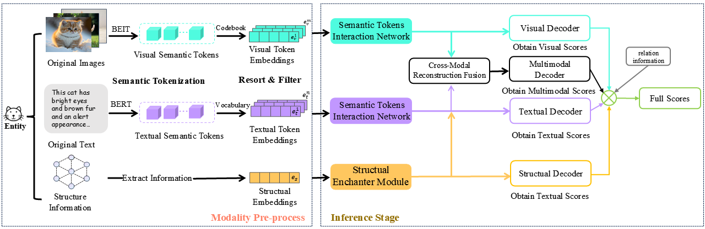
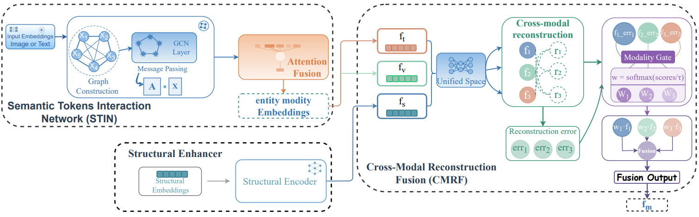

# Semantic Token Interaction and Reconstruction-Aware Fusion for Multi-Modal Knowledge Graph Completion

## Model Architecture



[](https://www.python.org/downloads/)
[](https://pytorch.org/)
[](https://opensource.org/licenses/MIT)

## 🔍 Key Contributions

STI-RF is a novel MKGC framework designed to handle imbalanced modality quality caused by noise or missing data. Our main contributions are:
1. **Semantic Token Interaction Network (STIN)**: Enhances intra-modal representations by modeling fine-grained token-level interactions via graph convolutions to suppress irrelevant noise.
2. **Cross-Modal Reconstruction Fusion (CMRF)**: An adaptive module that evaluates modality reliability through bidirectional reconstruction and consistency-aware gating.
3. **Decoupled Reasoning & Aggregation**: Employs independent Transformer-based decoders to mitigate semantic interference, with a relation-guided mechanism for adaptive score aggregation.
4. **State-of-the-art Performance**: Superior results on DB15K, MKG-W, and MKG-Y, demonstrating high robustness against imbalanced modality quality.


## 🚀 Quick Start

### Installation
```bash
conda create -n stirf python=3.8
conda activate stirf

pip install -r requirements.txt
```

### Training
```bash
python main.py \
  --dataset DB15K \
  --dim 256 \
  --lr 5e-4 \
  --batch_size 2048 \
  --num_epoch 1000 \
  --gpu 0 \
  --emb_dropout 0.9 \
  --vis_dropout 0.4 \
  --txt_dropout 0.1 
```

### Evaluation
```bash
python main.py --eval --dataset DB15K --ckpt_path ./checkpoints/model_best.ckpt
```

#### Details
- Python==3.8.10
- numpy==1.24.2
- scikit_learn==1.2.2
- scipy==1.10.1
- torch==2.0.0
- tqdm==4.64.1
- transformers==4.28.0


## 📂 Data Preparation
1. Download the datasets (DB15K, MKG-W, or MKG-Y) and place them in the data/ directory.
2. Ensure the following directory structure (using DB15K as an example):
```
data/
└── DB15K/
    ├── entities.txt            # List of entities
    ├── relations.txt           # List of relations
    ├── entity2id.txt           # Entity to ID mapping
    ├── relation2id.txt         # Relation to ID mapping
    ├── train.txt               # Training set
    ├── valid.txt               # Validation set
    ├── test.txt                # Test set
    ├── index-neighbor.pkl      # Precomputed neighbor index
    ├── neighbors.txt           # Raw neighbor information
    ├── img_feature.pkl         # Multi-modal visual tokens
    └── txt_feature.pkl         # Multi-modal textual tokens
```
## 📜 Citation
The full citation will be available upon formal publication.

## 🤝 Contact
For questions, collaborations, or issues regarding STI-RF, please feel free to contact:

📧 tgf842655@dlmu.edu.cn